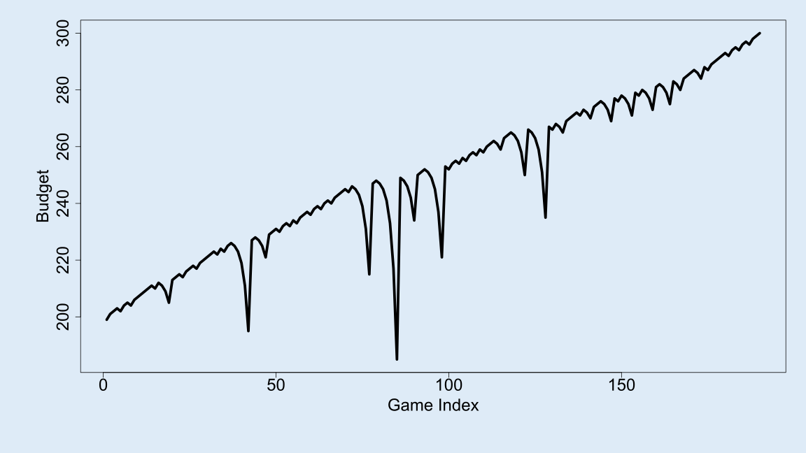

# Roulette Simulation with Martingale Strategy

## Overview

This academic project explores the effectiveness of the **Martingale betting strategy** in the context of roulette, a game with well-known probabilities. The Martingale strategy involves doubling one’s wager after every loss, under the assumption that a win will eventually occur, recouping all previous losses and yielding a net gain equal to the original bet.

The project simulates thousands of roulette games to evaluate budget trajectories, average earnings, and the impact of varying game parameters (e.g., starting budget, winning threshold, max wager). All simulations and visualizations are implemented in **R**.

## Goals

- Simulate a single game series using the Martingale strategy.
- Track budget over time to illustrate gains/losses visually.
- Replicate game series to calculate average earnings.
- Analyze how changing key parameters affects performance.
- Gauge the number of plays before a series concludes.

## Key Functions

### `single_spin()`
Simulates a single roulette spin with correct probabilities:  
- 18/38 red  
- 18/38 black  
- 2/38 green  

### `martingale_wager()`
Implements the Martingale betting logic.  
If the last spin was a win, the player resets to a $1 bet.  
Otherwise, the bet is doubled, capped by the max wager and remaining budget.

### `one_play()`
Simulates one play of roulette and updates the ledger with:
- Game index
- Starting budget
- Wager placed
- Outcome (red/black/green)
- Ending budget

### `one_series()`
Simulates an entire series of games until one of two stopping conditions are met:
- Player hits or exceeds a winning threshold
- Player runs out of money

### `stopping_rule()`
Defines stopping logic based on whether the player's ending budget is:
- ≤ 0 (bankruptcy)
- ≥ winning threshold (goal achieved)

### `profit()`
Calculates net profit at the end of a series:  
`ending_budget - starting_budget`

## Example Visualizations

Two SVG plots demonstrate how budget can trend up or down across one series of games depending on luck and spin outcomes.

### Losing Series Example


### Winning Series Example



These examples highlight the volatility of the Martingale strategy—especially under tight wager limits and small budgets.

## Analysis and Experiments

### Average Earnings Across Multiple Series

By replicating 1,000 series with fixed parameters:

```r
replicate(1000, one_series(1000, 200, 300, 100) |> profit()) |> mean()
```

**Result:**  
Average earnings ≈ -48.824  
This suggests that despite occasional gains, the strategy is **not profitable on average**, due to eventual ruin from a streak of losses and wager limits.

### Effect of Starting Budget

The simulation varies starting budgets from $100 to $500 in $100 increments while adjusting the winning threshold to always be $100 higher.

Each starting budget is tested across 1,000 replications:

```r
starting_budgets <- seq(100, 500, by = 100)
ae <- numeric(length(starting_budgets))

for(i in 1:length(starting_budgets)){
  ae[i] <- replicate(1000, one_series(1000, 
                                      starting_budgets[i], 
                                      starting_budgets[i] + 100, 
                                      100) |> profit()) |> mean()
}
plot(starting_budgets, ae, 
     main = 'Effect of Starting Budgets on Average Earnings',
     ylab = 'Average Earnings',
     xlab = 'Starting Budget',
     type = 'l')
```


### Insight:
Higher starting budgets slightly reduce average losses, but the trend remains negative—reinforcing the **risky and unsustainable** nature of the Martingale strategy under realistic constraints.

## Conclusion

This simulation shows that while the Martingale strategy can produce short-term wins, it is not a reliable long-term strategy. Limited budgets and capped wagers drastically reduce its effectiveness and can lead to significant losses. These results highlight the danger of assuming a "guaranteed win" strategy in probabilistic environments like roulette.

## Technologies Used

- Language: **R**
- Libraries: `magrittr` for piping
- Output: SVG visualizations of budget over time

## Author Notes

This project was created as part of an academic assignment. The goal was to demonstrate practical simulation, probability modeling, and statistical interpretation of a real-world gambling strategy using code and visuals.
