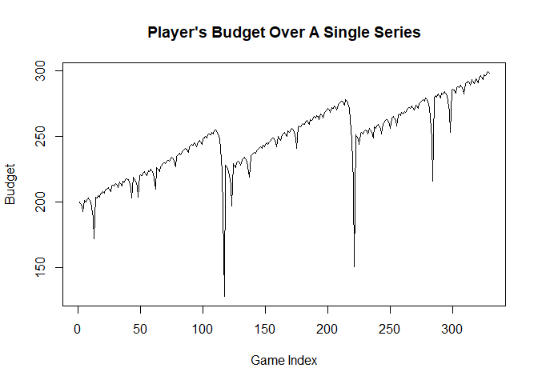
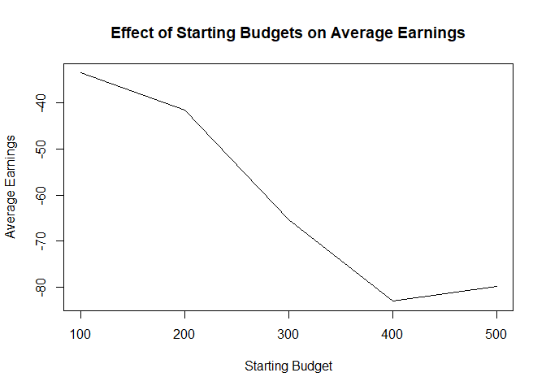

## Introduction

Below is the provided code to go alongside this blog post.

## Provided Code

    single_spin <- function(){
      possible_outcomes <- c(rep("red",18), rep("black",18), rep("green",2))
      sample(possible_outcomes, 1)
    }

    martingale_wager <- function(
        previous_wager
      , previous_outcome
      , max_wager
      , current_budget
    ){
      if(previous_outcome == "red") return(1)
      min(2*previous_wager, max_wager, current_budget)
    }

    one_play <- function(previous_ledger_entry, max_wager){
      # Create a copy of the input object that will become the output object
      out <- previous_ledger_entry
      out[1, "game_index"] <- previous_ledger_entry[1, "game_index"] + 1
      out[1, "starting_budget"] <- previous_ledger_entry[1, "ending_budget"]
      out[1, "wager"] <- martingale_wager(
        previous_wager = previous_ledger_entry[1, "wager"]
        , previous_outcome = previous_ledger_entry[1, "outcome"]
        , max_wager = max_wager
        , current_budget = out[1, "starting_budget"]
      )
      out[1, "outcome"] <- single_spin()
      out[1, "ending_budget"] <- out[1, "starting_budget"] + 
        ifelse(out[1, "outcome"] == "red", +1, -1)*out[1, "wager"]
      return(out)
    }

    one_series <- function(
      max_games, starting_budget, winning_threshold, max_wager
    ){
      # Initialize ledger
      ledger <- data.frame(
          game_index = 0:max_games
        , starting_budget = NA_integer_
        , wager = NA_integer_
        , outcome = NA_character_
        , ending_budget = NA_integer_
      )
      ledger[1, "wager"] <- 1
      ledger[1, "outcome"] <- "red"
      ledger[1, "ending_budget"] <- starting_budget
      for(i in 2:nrow(ledger)){
        #browser()
        ledger[i,] <- one_play(ledger[i-1,], max_wager)
        if(stopping_rule(ledger[i,], winning_threshold)) break
      }
      # Return non-empty portion of ledger
      ledger[2:i, ]
    }

    stopping_rule <- function(
      ledger_entry
      , winning_threshold
    ){
      ending_budget <- ledger_entry[1, "ending_budget"]
      if(ending_budget <= 0) return(TRUE)
      if(ending_budget >= winning_threshold) return(TRUE)
      FALSE
    }

    profit <- function(ledger){
      n <- nrow(ledger)
      profit <- ledger[n, "ending_budget"] - ledger[1, "starting_budget"]
      return(profit)
    }

    require(magrittr)

    ## Loading required package: magrittr

    svg(filename = "loser.svg", width=16, height =9)
    par(cex.axis=2, cex.lab = 2, mar = c(8,8,2,2), bg = rgb(222, 235, 247, max = 255))
    set.seed(1)
    ledger <- one_series(200,200,300,500)
    plot(ledger[,c(1,5)], type = "l", lwd = 5, xlab = "Game Index", ylab = "Budget")
    dev.off()

    ## png 
    ##   2

    svg(filename = "winner.svg", width=16, height =9)
    par(cex.axis=2, cex.lab = 2, mar = c(8,8,2,2), bg = rgb(222, 235, 247, max = 255))
    set.seed(2)
    l2 <- one_series(200,200,300,500)
    plot(l2[,c(1,5)], type = "l", lwd = 5, xlab = "Game Index", ylab = "Budget")
    dev.off()

    ## png 
    ##   2

## Introduction

A very popular casino game, roulette, is played by chancing a bet on
either a red, green, or black pocket each with a 18/38, 2/38, and an
18/38 probability respectively. In this blog post, I will aim to
calculate the average earnings of an individual that uses the
“Martingale Strategy”: a strategy where an individual doubles their bet
after each loss with the goal of recovering previous losses while making
a profit. I will do this by first showing how a player’s budget changes
over the course of a single series of games with the strategy. I will
then go on to calculate the average earnings per series with this
strategy, and then examine the effect of changing different parameters
on our average earnings. From there, I will guage the average number of
plays before a series concludes.

## Earnings over time

To start, the best way to observe the effect of the Martingale strategy
is to observe its results overtime. In the code I have below, we create
a simulation of a roulette game, and store the results per game into a
ledger. We will then use this ledger to graph, for any random seed, the
budget of a player as the number of plays increase.

You can run with different seeds 1-3 times to get a sense of the
variability of a player’s budget trajectory. It’s good to show that it
can be either positive (winning) or negative (losing).

    # create a ledger using the default parameters
    # default parameters come from the assignment instructions

    set.seed(20302)
    ledger <- one_series(1000, 200, 300, 100)

    # showing what the ledger is
    head(ledger)

    ##   game_index starting_budget wager outcome ending_budget
    ## 2          1             200     1   black           199
    ## 3          2             199     2   black           197
    ## 4          3             197     4   black           193
    ## 5          4             193     8     red           201
    ## 6          5             201     1   black           200
    ## 7          6             200     2     red           202

    # plot the ledger
    plot(ledger$game_index, ledger$starting_budget, 
         xlab = 'Game Index', 
         ylab = 'Budget',
         main = "Player's Budget Over A Single Series",
         type = 'l')

From the graph here, it would appear that there is a massive fluctation
between losing a lot of money, and gaining a lot. Overall, the graph
does appear to be trending upward. Perhaps indicating that the strategy
may be effective.

However, let’s look at the average earnings per series to get a better
estimate on the effectiveness of this strategy.

## Average Earnings

What we can do here is replicate the roulette series many times over,
and calculate the overall profit each time, and then take the mean after
all of the replications. In doing these calculations, our results are
shown below:

    # we can do one_series 1000 times then take mean profit
    # using the default parameters from the instructions

    replicate(1000, one_series(1000, 200, 300, 100) |> profit()) |> mean()

    ## [1] -48.824

As we can see, the average earnings for the martingale strategy is less
than ideal with an average of -48.824 earnings, or a loss of 48.824.
This does make sense in contrast to the graph we have above. Since there
is a high fluctation, and an extremely low peak near 0, we can see in
this example that the player of this game, on average, was losing more
times than winning, and it would appear that toward the end, they were
gaining a lucky streak that allowed them to finish the game on a
positive earning.

Now that we have looked at the change of earnings overtime and the
average earnings per series, let’s see how the average can change in
response to different paramaters in our game.

## Changing Parameters Effect

You can repeat this process for the other parameters as well. This
example is looking at starting budget. Just make sure that that all
combinations of the parameters makes sense. For example, you don’t want
the starting budget to be greater than the winning threshold, otherwise
the game stops right away.

For instance, what if we were to arbitrarily change the amount that
started our budget at? Let’s make a graph between a budget of $100 and
$500 with $100 increments. We will then calculate the average earnings
of each game with these starting budgets.

    # ex. Starting Budget

    # get a range of starting budgets
    starting_budgets <- seq(100, 500, by = 100)

    # create a vector to store the average earnings for each starting budget
    # make it the length of the starting budgets we are looping over
    ae <- numeric(length(starting_budgets))

    # create a for loop, going through each starting budget value
    for(i in 1:length(starting_budgets)){
      # replicate 1000 times with these settings, changing the starting budget each time
      # winning threshold is 100 more than the starting budget each time
      # could also just set winning threshold to be a large number that starting budget
      # never goes over
      # ae[i] stores the average earning in the ith place
      # starting_budgets[i] selects the ith starting budget to use for this loop
      ae[i] <- replicate(1000, one_series(1000, 
                                          starting_budgets[i], 
                                          starting_budgets[i] + 100, 
                                          100) |> profit()) |> mean()
    }

    # now plot the results
    # starting budget on the x-axis, average earnings on the y-axis

    plot(starting_budgets, ae, 
         main = 'Effect of Starting Budgets on Average Earnings',
         ylab = 'Average Earnings',
         xlab = 'Starting Budget',
         type = 'l')

Based on the graph here, it would appear that it would be better to
employ the Martingale strategy with a lower starting budget rather than
higher. We can see a drastic decline in earnings in the graph as the
budget increases, and it is important to note that for all of these
values, they are all still negative in earnings.

Now this does give us insight into the starting budget, but what about
the average number of plays before a game is over, defined by a stopping
rule of $300 reached or 1000 games played?

## Number of Plays

In this specific case, we can calculate the average number of plays by
replicating 1000 games and counting the amoung of series they had, and
then averaging out all of these counts.

    # each row in the ledger is one play, we can get the number of plays using the number of rows

    replicate(1000, one_series(1000, 200, 300, 100) |> nrow()) |> mean()

    ## [1] 200.219

With these calculations, we see that our average amount of games before
a stopping rule applies is around 200.

## Limitations of this Study

As with any simulation, there are many simplifications and assumptions
that must be made in order to create a model. Becuase of this, this can
cause limitations in the simulation itself. The simulations that I used,
specifically with Bella are limited in the sense of looking at a
specific seed for Bella’s night at the casino. It may seem that Bella is
very lucky, when in reality, each new spin of a roulette wheel is very
variable. In this simulation, we had to assume first that the roulette
wheel was not biased. We also have to assume the gambler only stops when
a stopping rule is met, but there could be cases where a gambler has to
leave before the rules are satisfied, maybe they have a phone call, or
maybe they got kicked out of the casino. The simulation also fails to
account for casino win limits, where an individual is unable to earn
more than a designated amount set by a casino in the event that they win
a lot. Overall, there is still uncertainty among these real world
factors that prevent that model from being a direct representation of
reality, but the simulation does well to mimic it.
